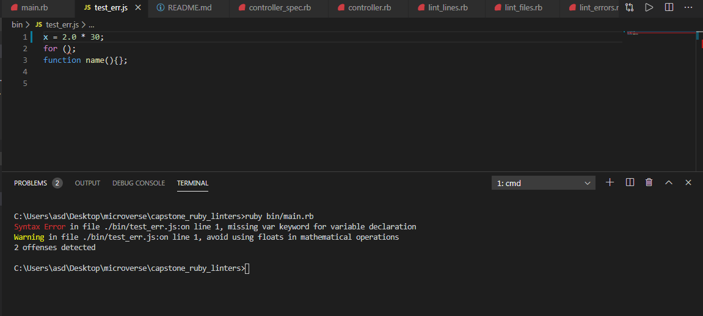
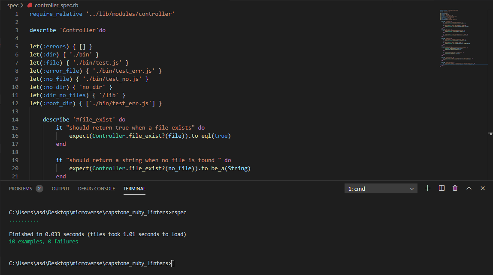

# capstone_ruby_linters

## Description

This is a capstone project for comming up with a linter built in ruby. The linter built in this case is to help beginners in javaScript check for some characters that may lead to errors when forgoten while writing javascript code for example forgetting the use of Var keyword when declaring variables, performing mathematical operations using floats, missing semi colon at the end of a statement, adding strings to itegers, using = sign in if conditional and forgeting to close open parenthesis.

## How to run the linter

- clone the project and add the file or files to be linted in the project directory
- excecute the main.rb file inside bin/main.rb
- You can as well specify the path to the files to be linted as a commandline argument e.g 
bin/main.rb path/file_name or bin/main.rb path/directory_name
- Note this can only be done when the javascript files are included inside the project directory

## Good and Bad code

## Bad code
   `var x = 1 + 2` missing semi colon at end of statement
   `x = 1 + 2;` missing var key word for variable declaration
   `var x = "1" + 2;` detected adding an integer to a string
   `var x = 1.0 + 2;` avoid using floats in mathematical operations
   `if(x=y);` invalid comparison operator for if condition

## Good code
   `var x = 1 + 2;` 
   `if(x==y);` invalid comparison operator for if condition

## test cases

## Built With

- Ruby
- Vs Code
- Rubocop
- rspec
- colorize

## Live Demo

[Live Demo Link](https://repl.it/github/frankopkusianwar/capstone_ruby_linters)

## Getting Started

To get a local copy up and running follow these simple example steps.

### Prerequisites

- Ruby
- rspec

### Usage

- Clone the project to your local machine

## Instructions
- add the javascript files as described in how to use the linter above
- Open the file of the project on your terminal, and then type bin/main.rb and press enter.
- To run the test cases, open the root folder in your terminal and run the rspec command

## Author

- Okiror Frank

👤 **Okiror Frank**

- Github: [@frankopkusianwar](https://github.com/frankopkusianwar)
- Twitter: [@franko0781](https://twitter.com/franko0781)
- Linkedin: [Okiror Frank](https://linkedin.com/in/frank-okiror-250076b5)
- Email: okirorfrank3@gmail.com

## 🤝 Contributing

Contributions, issues and feature requests are welcome!

Feel free to check the [issues page](issues/).

## Show your support

Give a ⭐️ if you like this project!

## Acknowledgments

- Microverse, standup team and the microverse community for helping build the skills that were used on this project

## 📝 License

This project is [MIT](lic.url) licensed.
